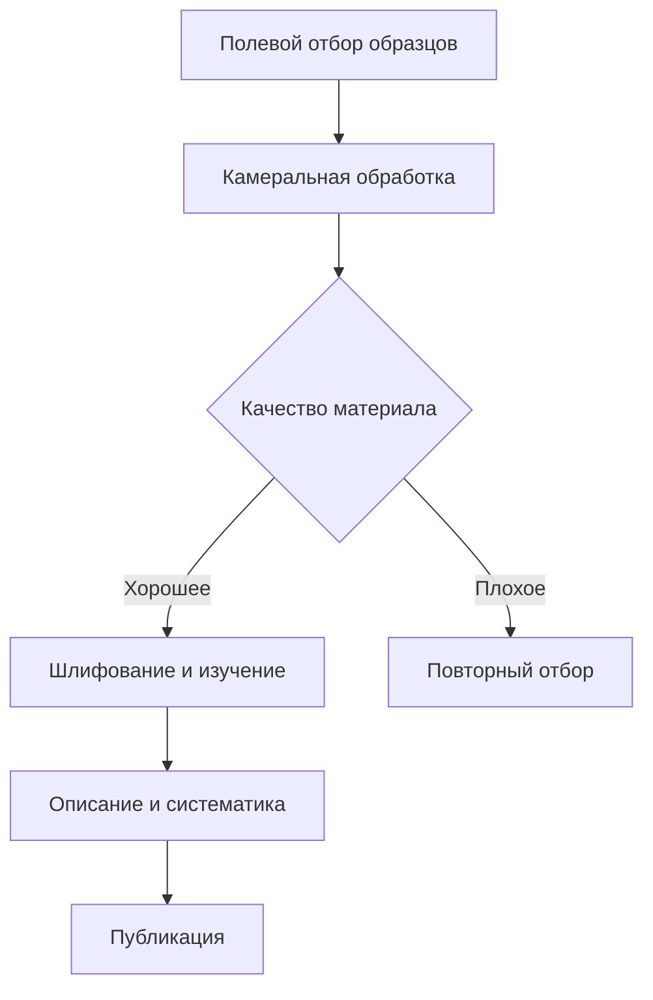
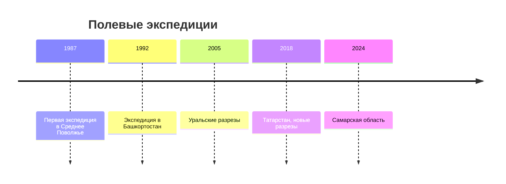
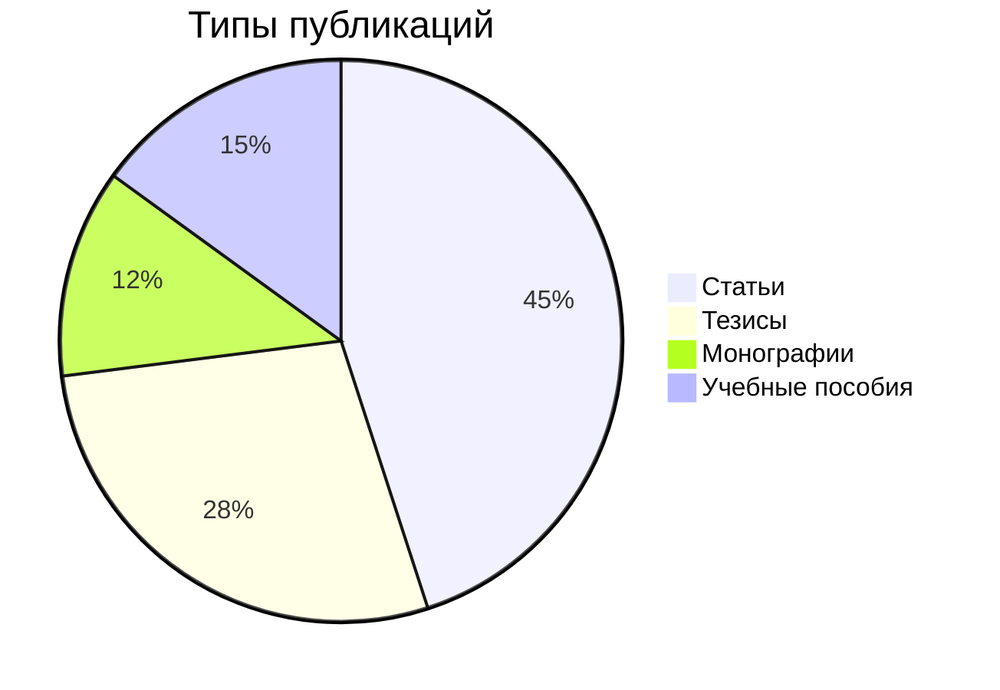
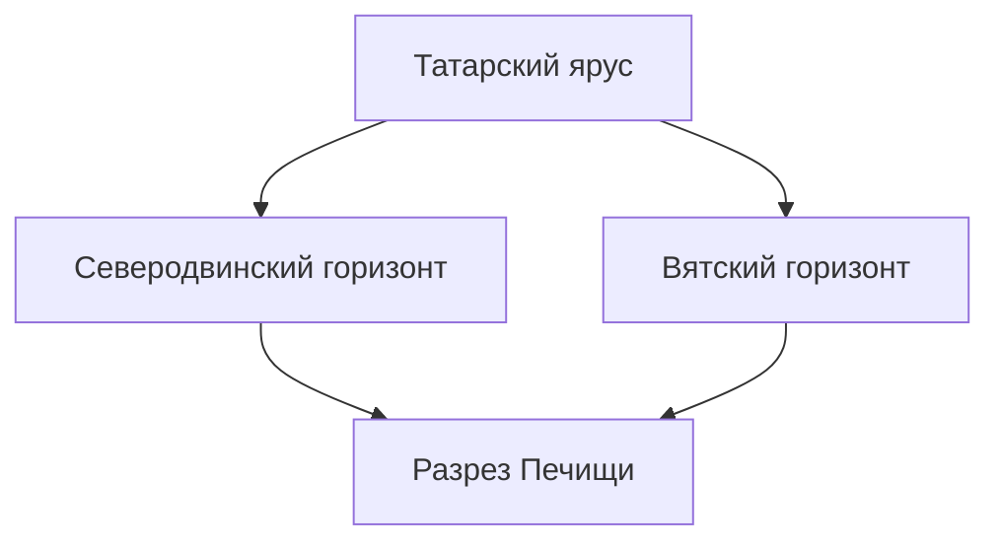
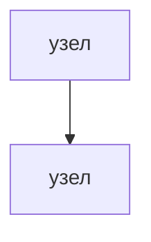

# Справка: Markdown-форматирование статей для геопортала

Этот файл описывает все поддерживаемые элементы разметки. Его можно скопировать целиком и передать ИИ-ассистенту (Claude, ChatGPT и др.) вместе с текстом статьи — ИИ самостоятельно оформит текст в правильный формат.

---

## Быстрая шпаргалка

| Что нужно             | Синтаксис                                           |
|:----------------------|:----------------------------------------------------|
| Жирный текст          | `**жирный**`                                        |
| Курсив                | `*курсив*`                                          |
| Жирный курсив         | `***жирный курсив***`                               |
| Заголовок раздела     | `## Заголовок`                                      |
| Подзаголовок          | `### Подзаголовок`                                  |
| Мелкий заголовок      | `#### Пункт`                                        |
| Маркированный список  | `- Пункт`                                           |
| Нумерованный список   | `1. Пункт`                                          |
| Ссылка                | `[текст ссылки](https://example.com)`               |
| Изображение           | ``                   |
| Изображение слева     | ``                    |
| Изображение справа    | ``                   |
| Видео YouTube         | `@[youtube](ID_видео)`                              |
| Видео Vimeo           | `@[vimeo](ID_видео)`                                |
| Цитата / примечание   | `> текст`                                           |
| Горизонтальный разделитель | `---`                                          |
| Встроенный код        | `` `код` ``                                         |
| Блок кода             | ` ```язык ` ... ` ``` `                             |
| Диаграмма             | ` ```mermaid ` ... ` ``` `                          |
| Математическая формула (инлайн) | `$E = mc^2$`                            |
| Математическая формула (блок) | `$$E = mc^2$$`                            |
| Таблица               | см. раздел «Таблицы» ниже                           |

---

## Подробное описание элементов

### Заголовки

```markdown
## Крупный заголовок раздела

### Подзаголовок второго уровня

#### Пункт третьего уровня
```

> Заголовок первого уровня (`# Заголовок`) зарезервирован для названия статьи — не используйте его внутри текста.

---

### Текст и выделение

```markdown
Обычный абзац. Чтобы начать новый абзац — оставьте пустую строку.

Это **жирный текст** и это *курсив*.
Можно сочетать: ***жирный курсив***.

Ссылка: [Журнал Стратиграфия](https://stratigr.ru)
```

---

### Списки

**Маркированный список:**
```markdown
- Неморские двустворчатые моллюски
- Пермские отложения Поволжья
- Методы изучения керна
```

**Нумерованный список:**
```markdown
1. Подготовка полевого оборудования
2. Отбор образцов
3. Камеральная обработка
4. Написание отчёта
```

---

### Изображения

Изображения нужно сначала загрузить через кнопку «📷» в тулбаре — после загрузки путь подставится автоматически.

**Изображение по центру (по умолчанию):**
```markdown

```

**Изображение с выравниванием:**
```markdown


Текст обтекает изображение слева. Это удобно для иллюстраций,
которые дополняют текст, не прерывая его.

---


Изображение справа, текст слева. Разделитель `---` ниже
сбросит обтекание.
```

> **Выравнивание:** `|left` — слева, `|right` — справа, без указания — по центру, на всю ширину.

---

### Видео

Нажмите кнопку «▶» в тулбаре, вставьте ссылку на YouTube или Vimeo.

**YouTube:**
```markdown
@[youtube](dQw4w9WgXcQ)
```
Принимаются форматы ссылок:
- `https://youtu.be/dQw4w9WgXcQ`
- `https://www.youtube.com/watch?v=dQw4w9WgXcQ`

Тулбар автоматически извлечёт ID видео.

**Vimeo:**
```markdown
@[vimeo](148751763)
```

---

### Таблицы

```markdown
| Автор          | Год  | Тема                                  |
|:---------------|:----:|--------------------------------------:|
| Силантьев В.В. | 2018 | Двустворки перми Среднего Поволжья    |
| Силантьев В.В. | 2021 | Стратиграфия визейских отложений      |
| Силантьев В.В. | 2024 | Доманиковые отложения Волго-Урала     |
```

Выравнивание в колонках: `:---` — влево, `:---:` — по центру, `---:` — вправо.

---

### Цитаты и примечания

```markdown
> Открытые системы — это системы, обменивающиеся веществом и энергией
> с окружающей средой. (Берталанфи, 1950)
```

Для научных примечаний:
```markdown
> **Примечание:** Образцы хранятся в фондовой коллекции кафедры
> палеонтологии КФУ, инв. № 2847–2851.
```

---

### Горизонтальный разделитель

Используйте `---` для разделения крупных смысловых блоков:

```markdown
## Результаты исследования

Описание результатов...

---

## Выводы

Заключение...
```

---

### Диаграммы (Mermaid)

Поддерживается синтаксис [Mermaid](https://mermaid.js.org). Диаграмма рендерится прямо на странице.

**Блок-схема:**
```markdown

```

**Временная шкала (геологическая):**
```markdown

```

**Круговая диаграмма:**
```markdown

```

---

### Математические формулы (LaTeX)

Используется библиотека KaTeX.

**Инлайн-формула** (в строке текста):
```markdown
Стандартная погрешность измерения составляет $\sigma = \sqrt{\frac{\sum(x_i - \bar{x})^2}{n-1}}$.
```

**Формула-блок** (на отдельной строке):
```markdown
$$
\delta^{13}C = \left(\frac{R_{sample}}{R_{standard}} - 1\right) \times 1000\permil
$$
```

Примеры геологических формул:
```markdown
Возраст по U-Pb методу: $t = \frac{1}{\lambda}\ln\left(\frac{^{206}Pb}{^{238}U} + 1\right)$

Коэффициент отражения витринита: $R_o = \frac{I_{sample}}{I_{standard}} \times 100\%$
```

---

### Блок кода

Для вставки числовых данных, координат, формул в текстовом виде:

```markdown
```
Координаты разреза: 55°47'32"N, 49°06'18"E
Мощность пачки: 12.4 м
Кол-во образцов: 47
```
```

С подсветкой синтаксиса (для Python, R, и др.):
```markdown
```python
import pandas as pd

df = pd.read_csv('samples.csv')
print(df.describe())
```
```

---

### Встроенный код

Для терминов, координат, формул прямо в тексте:

```markdown
Используемый метод: `ICP-MS`. Глубина отбора: `47.3 м`. Формат данных: `CSV`.
```

---

## Полный пример статьи

```markdown
## Введение

Исследование **неморских двустворчатых моллюсков** верхней перми
Среднего Поволжья охватывает разрезы в пределах Татарстана,
Ульяновской и Самарской областей.

Настоящая работа является продолжением цикла исследований
[Силантьев, 2018; 2021].

---

## Объекты исследования

### Разрез Печищи


Разрез вскрывает толщу казанского яруса мощностью около **24 метров**.
Отложения представлены переслаиванием карбонатных и терригенных пород.

> **Примечание:** Разрез труднодоступен в весенний период из-за
> паводка на Волге.

---

### Стратиграфическая схема



---

## Методы

Образцы обрабатывались методом `HCl-растворения`.
Всего изучено **247 экземпляров** из **12 разрезов**.

| Разрез        | Кол-во образцов | Ярус    | Горизонт   |
|:--------------|:---------------:|:--------|:----------:|
| Печищи        | 47              | Казанский | Уфимский |
| Сорочьи горы  | 38              | Казанский | Казанский |
| Шуран         | 62              | Татарский | Вятский  |

---

## Видеоматериалы

@[youtube](ВИДЕО_ID)

---

## Выводы

1. Впервые описано **3 новых вида** двустворок из семейства Palaeomutela.
2. Уточнена **биостратиграфическая схема** верхнепермских отложений.
3. Установлена связь с разрезами **Башкортостана** и **Оренбургской области**.
```

---

## Инструкция для ИИ-ассистента

Скопируйте блок ниже и вставьте его в начало запроса к ИИ, добавив текст своей статьи:

---

```
Ты помогаешь оформить научную статью для публикации на сайте профессора-геолога.
Сайт поддерживает специальный диалект Markdown. Вот правила форматирования:

ЗАГОЛОВКИ:
- ## Раздел  — крупный заголовок
- ### Подраздел  — подзаголовок
- #### Пункт  — мелкий заголовок
- НЕ используй # (H1) — это зарезервировано для названия

ТЕКСТ:
- **жирный**, *курсив*, ***жирный курсив***
- [текст](ссылка) для ссылок

СПИСКИ:
- Маркированные: начинай строку с `- `
- Нумерованные: начинай с `1. `, `2. ` и т.д.

ИЗОБРАЖЕНИЯ (ВАЖНО — пути указывает владелец):
-  — по центру
-  — слева, текст обтекает
-  — справа, текст обтекает
- Вместо реального пути используй: /uploads/ОПИСАНИЕ-ФОТО.jpg

ВИДЕО:
- @[youtube](ID_ВИДЕО) — встроенный плеер YouTube
- ID — это часть ссылки после youtu.be/ или ?v=

ТАБЛИЦЫ:
| Заголовок 1 | Заголовок 2 |
|:------------|------------:|
| Данные      | Данные      |
Выравнивание: :--- влево, ---: вправо, :---: по центру

ЦИТАТЫ:
> Текст цитаты или примечания

РАЗДЕЛИТЕЛИ:
--- (три дефиса на отдельной строке)

ДИАГРАММЫ:


ФОРМУЛЫ LaTeX:
- Инлайн: $формула$
- Блок: $$формула$$

ЗАДАЧА: Возьми текст ниже и оформь его в соответствии с этими правилами.
Структурируй текст, выдели заголовки, оформи списки и таблицы где нужно.
Для изображений используй плейсхолдеры вида /uploads/название-фото.jpg —
владелец заменит пути при вставке на сайт.
Выведи ТОЛЬКО готовый Markdown без пояснений.

ТЕКСТ СТАТЬИ:
[вставьте текст здесь]
```

---

*Файл доступен по адресу `/ARTICLE_FORMAT.md` на сайте. Последнее обновление: 2026-06.*
